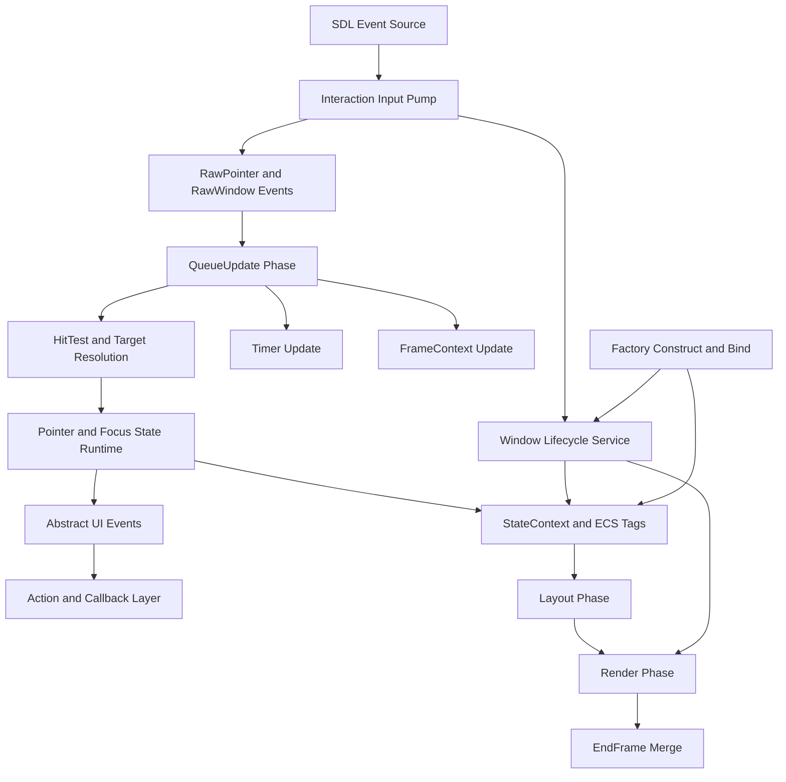

# UI 模块设计基线（Phase 0）

日期：2026-03-26

## 文档定位

本文档是 UI 模块 Phase 0 的统一设计基线。

它用于完成以下目标：

1. 合并现有评审文档结论。
2. 统一“局部止血”和“长期蓝图”的边界。
3. 明确保留项与重构项。
4. 产出 runtime 职责图和系统迁移表。

Phase 0 完成后，后续关于 UI 模块的重构讨论应以本文档为基准，不再让不同文档从不同角度重复定义目标。

## 输入来源

本基线文档整合以下材料：

1. [../reviews/ui-architecture-review-2026-03-26.md](../reviews/ui-architecture-review-2026-03-26.md)
2. [../reviews/ui-coverage-review-2026-03-26.md](../reviews/ui-coverage-review-2026-03-26.md)
3. [../phase/ui-runtime-roadmap-2026-03-26.md](../phase/ui-runtime-roadmap-2026-03-26.md)
4. [../reviews/ui-architecture-review-2026-03-24.md](../reviews/ui-architecture-review-2026-03-24.md)

## 基线结论

### 一句话结论

UI 模块当前不是“需要重写”，而是“需要把已经存在的正确方向收敛成显式 runtime 边界”。

### 统一判断

1. 对外 API 和 DSL 比内部 runtime 更健康。
2. 渲染体系整体可保留，问题主要集中在交互、调度和生命周期边界。
3. 当前最大的债不是局部性能，而是隐式依赖、隐式 phase、隐式状态迁移。
4. 第一阶段止血工作是必要且有效的，但它只是收口，不是终态。
5. 长期蓝图不应否定既有止血成果，而应把这些成果提升为正式设计边界。

### 统一后的重构总目标

UI 模块后续重构的核心不是“拆更多类”，而是建立以下五个稳定属性：

1. Runtime 边界清晰。
2. Phase 与事件语义清晰。
3. 交互状态链路按主题拆分。
4. Window 生命周期独立成稳定服务。
5. 关键隐式规则都有测试保护。

## 已确认保留项

以下内容被认定为稳定资产，后续重构默认保留：

| 保留项 | 原因 | 主要位置 |
|------|------|---------|
| 链式 DSL 与语义化 API | 对外表达力强，调用侧心智负担低 | [src/ui/api/Chains.hpp](src/ui/api/Chains.hpp) |
| ECS 组件数据模型 | 已形成稳定的组件化边界 | [src/ui/common/Components.hpp](src/ui/common/Components.hpp) |
| RenderSystem 渲染器分层 | 渲染能力已具备结构基础 | [src/ui/systems/RenderSystem.hpp](src/ui/systems/RenderSystem.hpp) |
| UiRuntime 活跃实例切换雏形 | 为多 runtime 和测试隔离提供了真实抓手 | [src/ui/core/UiRuntime.hpp](src/ui/core/UiRuntime.hpp) |
| WindowSync 初步抽离方向 | 已经证明窗口属性同步可独立出去 | [src/ui/common/WindowSync.hpp](src/ui/common/WindowSync.hpp) |
| TaskChain 骨架 | 固定帧流已经存在，后续应在其上显式化 phase，而不是推翻 | [src/ui/core/TaskChain.hpp](src/ui/core/TaskChain.hpp) |

## 已确认重构项

以下内容被认定为 Phase 1 以后必须继续推进的主线问题：

| 重构项 | 当前问题 | 目标方向 |
|------|---------|---------|
| Registry / Dispatcher 访问方式 | 静态入口扩散导致依赖隐式 | 收敛到 Runtime 边界 |
| TaskChain / SystemManager phase 语义 | 顺序存在但规则不显式 | 建立正式 phase 合约 |
| InteractionSystem | 输入接入、翻译、补救刷新职责混杂 | 拆成更清晰的交互链路 |
| StateSystem | Hover / Active / Focus / Scroll / Window 生命周期混合 | 按主题拆分状态职责 |
| HitTestSystem | 缓存失效靠分散监听维护 | 收敛缓存失效策略 |
| Factory | 构造与平台副作用混合 | 两阶段化：构造 / 绑定 |
| Window 生命周期 | 分散在多个系统和工厂逻辑中 | 独立服务层 |
| 高风险交互测试 | 平台补救、Focus、Drag、缓存失效覆盖不足 | 建立架构保护测试 |

## 止血成果与长期蓝图的统一规则

为避免后续文档再次分叉，明确以下统一规则：

### 规则 1

已完成的一阶段止血不视为临时补丁，而视为“边界收口的第一步”。

包括但不限于：

1. 平台补救刷新路径显式化。
2. WindowSync 初步抽离。
3. TaskChain 顺序测试补齐。
4. 部分 Utils / Visibility / Hierarchy 行为覆盖补齐。

### 规则 2

长期蓝图不是推翻止血成果，而是要求把这些收口进一步变成正式 runtime 设计。

### 规则 3

以后新增设计决策都必须回答两个问题：

1. 它属于哪一个 runtime 边界。
2. 它运行在什么 phase 中。

如果回答不清，就说明设计仍在回退到隐式规则。

## Runtime 职责图

下面的职责图描述的是“当前统一后的目标边界”，不是现状代码已经完全达到的状态。

### 职责解释

1. Interaction Input Pump 负责接入 SDL，不负责实现完整 UI 行为。
2. HitTest 负责命中与目标解析，不负责完整交互状态决策。
3. Pointer and Focus State Runtime 负责交互状态迁移与标签写回。
4. Window Lifecycle Service 负责窗口同步、窗口关闭、上下文生命周期相关行为。
5. Layout / Render / EndFrame 是固定 phase，不应继续被业务逻辑随意穿透。

## 系统迁移表

下表用于指导后续 Phase 1 到 Phase 3 的系统拆分，不要求一次完成，但要求迁移方向稳定。

| 当前系统或模块 | 当前主要职责 | 主要问题 | 目标归属 | 迁移阶段 |
|------|-------------|---------|---------|---------|
| InteractionSystem | SDL 事件轮询、输入翻译、键盘重复输入、平台补救刷新、部分窗口同步 | God Object，混合正常路径和补救路径 | Input Pump / Input Translator / Platform Compensation / WindowLifecycle 协作 | Phase 2-3 |
| HitTestSystem | Raw 输入转命中目标、缓存 Z 序交互实体 | 缓存失效策略分散 | 保留为 HitTest 和 Target Resolution 层 | Phase 3-4 |
| StateSystem | Hover、Active、Focus、Scrollbar、Slider、窗口关闭和同步 | 状态主题混杂、立即与延迟语义并存 | PointerState / FocusState / ScrollInteraction / WindowLifecycle | Phase 3-5 |
| ActionSystem | Click、Hover、Press、拖拽动效和回调 | 当前相对清晰，但依赖上游事件语义稳定 | 保留为抽象动作与回调层 | 保留 |
| TaskChain | Queue / Input / Render 固定脚本 | phase 语义不显式 | Phase 调度骨架 | Phase 1-2 |
| SystemManager | 系统注册与统一托管 | 顺序依赖不透明 | 按 Phase 组织的系统注册容器 | Phase 2 |
| UiRuntime | 活跃 Registry / Dispatcher 切换 | 能力存在但未成为统一入口 | Runtime Facade 基础 | Phase 1 |
| WindowSync | SDL 窗口属性同步 | 能力分散，生命周期不完整 | Window Lifecycle Service 基础 | Phase 5 |
| Factory | 创建实体、绑定 SDL_Window、触发图形上下文、副作用回滚 | 构造与绑定耦合 | Construct Phase + Bind Phase | Phase 5-6 |

## Phase 0 输出约束

从本基线开始，后续文档和实现应遵守以下约束：

1. 讨论 Runtime 边界时，以 UiRuntime、Registry、Dispatcher、GlobalContext 的统一收口为主线。
2. 讨论交互链路时，以 InteractionSystem、HitTestSystem、StateSystem、ActionSystem 的职责分层为主线。
3. 讨论窗口逻辑时，不再默认把它归入 StateSystem 的附属逻辑，而是按 Window Lifecycle 视角评估。
4. 讨论性能优化时，默认排在 Runtime 边界和 Phase 规则收敛之后。

## 与现有文档的关系

为避免重复维护，现有文档在 Phase 0 之后的角色定义如下：

| 文档 | 后续角色 |
|------|---------|
| [../reviews/ui-architecture-review-2026-03-26.md](../reviews/ui-architecture-review-2026-03-26.md) | 保留为批判性评审记录 |
| [../reviews/ui-coverage-review-2026-03-26.md](../reviews/ui-coverage-review-2026-03-26.md) | 保留为覆盖率和止血成果记录 |
| [../phase/ui-runtime-roadmap-2026-03-26.md](../phase/ui-runtime-roadmap-2026-03-26.md) | 保留为长期路线图 |
| [../phase/ui-phase1-runtime-facade-draft-2026-03-26.md](../phase/ui-phase1-runtime-facade-draft-2026-03-26.md) | 保留为 Phase 1 设计草案 |
| [../research/ui-hfsm2-feasibility-draft-2026-03-26.md](../research/ui-hfsm2-feasibility-draft-2026-03-26.md) | 保留为交互状态机专题评估 |
| 本文档 | 作为统一设计基线，优先级最高 |

以下文档不再作为当前 UI 重构主线输入：

1. `ui-next-steps.md`

原因：

1. 该文档以功能待办为主，缺少 Runtime 边界和 Phase 语义。
2. 其中的目标优先级与当前基线文档不一致。
3. 若继续保留为活跃文档，会与 Phase 驱动的重构路线冲突。

## Phase 0 完成判定

以下条件满足后，可视为 Phase 0 文档化工作完成：

1. UI 模块的保留项与重构项已经写清楚。
2. Runtime 职责图和系统迁移表已经形成统一说法。
3. “局部止血”和“长期蓝图”已经被统一到同一套目标语言下。
4. 后续 Phase 1 的设计与实施可以直接从本文档继续展开。

## 下一步建议

Phase 0 之后，建议按下面顺序推进：

1. Phase 1：基于 [src/ui/core/UiRuntime.hpp](src/ui/core/UiRuntime.hpp) 建立显式 Runtime Facade。
2. Phase 2：在 [src/ui/core/TaskChain.hpp](src/ui/core/TaskChain.hpp) 和 [src/ui/core/SystemManager.hpp](src/ui/core/SystemManager.hpp) 上显式化 phase。
3. Phase 3：先拆 InteractionSystem，再拆 StateSystem。

这三步是后续所有结构性改进的地基。