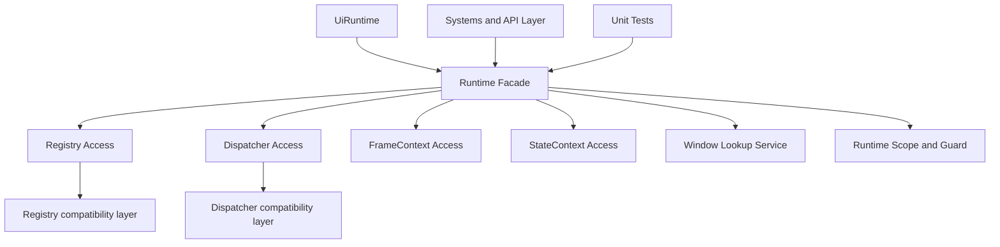

# UI 模块 Phase 1 草案：显式 Runtime Facade

日期：2026-03-26

## 文档定位

本文档是 UI 模块 Phase 1 的设计草案。

Phase 1 的目标不是拆系统，也不是引入新的交互模型，而是先把当前已经存在的多 runtime 雏形正式收敛成显式 Runtime 边界。

本文档以 [../baseline/ui-design-baseline-2026-03-26.md](../baseline/ui-design-baseline-2026-03-26.md) 为上位基线，用于回答以下问题：

1. Runtime Facade 要解决什么问题。
2. 它的最小边界是什么。
3. 如何在不打断现有系统的前提下渐进接入。
4. Phase 1 完成后，哪些问题算真正解决，哪些问题仍留给 Phase 2 和 Phase 3。

## 当前落地状态

截至 2026-03-26，本阶段已经不再只是纯草案，以下最小实现已经落地：

1. [../../core/RuntimeFacade.hpp](../../core/RuntimeFacade.hpp) 已建立正式命名的 runtime 访问边界。
2. `Application`、`TaskChain`、`TimerSystem`、`TweenSystem`、`ActionSystem`、`StateSystem` 已开始通过 facade 访问 `FrameContext` 或 `StateContext`。
3. [../../common/WindowEntityLookup.hpp](../../common/WindowEntityLookup.hpp) 维护的 `windowID -> entity` 运行时缓存，已经被提升为 `RuntimeFacade::current().windowLookup()` 下的子服务入口。
4. [../../tests/unittest/ui/test_UiRuntime.cpp](../../tests/unittest/ui/test_UiRuntime.cpp) 已覆盖 facade 随 runtime scope 切换，以及 window lookup 缓存在不同 runtime 之间隔离的行为。

这意味着 Phase 1 当前处于“边界已建立，关键路径已开始迁移”的状态，而不是“概念尚未落地”的状态。

## Phase 1 目标

### 主目标

建立显式 Runtime Facade，使 UI 模块内部对 Registry、Dispatcher、FrameContext、StateContext 的访问，不再只依赖隐式静态入口，而是具备一个正式、可迁移、可测试的运行时边界。

### 具体目标

1. 将 [src/ui/core/UiRuntime.hpp](src/ui/core/UiRuntime.hpp) 从“活跃实例切换雏形”提升为正式 Runtime 边界基础。
2. 为 Registry、Dispatcher、FrameContext、StateContext 提供统一获取入口。
3. 保持现有静态 API 可用，作为过渡兼容层，而不是立即全量替换。
4. 为后续 Phase 2 的 phase 显式化和 Phase 3 的系统拆分提供稳定依赖入口。

## Phase 1 不做什么

为了防止 Phase 1 范围失控，明确以下内容不属于本阶段：

1. 不重写 TaskChain。
2. 不拆分 InteractionSystem 和 StateSystem。
3. 不调整 LayoutSystem 和 RenderSystem 的内部结构。
4. 不重做 HitTest 缓存策略。
5. 不做 Factory 两阶段化。

这些内容都依赖 Runtime 边界先稳定。

## 当前问题复述

虽然 [src/ui/core/UiRuntime.hpp](src/ui/core/UiRuntime.hpp) 已经支持通过 UiRuntimeScope 切换当前运行时实例，但实际代码中大多数模块依然直接使用：

1. [src/ui/singleton/Registry.hpp](src/ui/singleton/Registry.hpp)
2. [src/ui/singleton/Dispatcher.hpp](src/ui/singleton/Dispatcher.hpp)
3. [src/ui/common/GlobalContext.hpp](src/ui/common/GlobalContext.hpp) 中挂在 Registry ctx 上的上下文组件

目前的问题不是功能上“不能多 runtime”，而是：

1. 运行时边界没有成为一等概念。
2. 调用点无法显式表达自己依赖哪个 runtime 服务。
3. 测试虽然能通过 UiRuntimeScope 做隔离，但这种能力还没有上升为模块级约束。

## 设计原则

Phase 1 设计必须遵守以下原则：

1. 不破坏当前可运行代码路径。
2. 先增加正式边界，再逐步迁移调用点。
3. 不把 Runtime Facade 设计成新的万能 God Object。
4. Facade 只收口 runtime 访问，不吞并业务语义。

## 目标边界

Phase 1 之后，建议形成如下边界：



### 边界解释

1. UiRuntime 仍然持有 Registry 与 Dispatcher 的实际实例。
2. Runtime Facade 负责统一暴露这些运行时服务。
3. Registry 和 Dispatcher 的静态入口短期继续存在，但其角色退化为兼容层。
4. 后续新代码优先依赖 Runtime Facade，而不是继续直接扩散静态访问。

## 建议的数据与接口模型

### 方案目标

不追求一次性把所有静态入口替换掉，而是先引入一个最小运行时访问对象，例如 RuntimeFacade 或 RuntimeServices。

### 最小职责集合

建议至少提供以下能力：

1. 获取 Registry
2. 获取 Dispatcher
3. 获取 FrameContext
4. 获取 StateContext
5. 获取窗口查询与失效服务
6. 判断当前 runtime 是否已初始化对应上下文

### 建议接口草形

```cpp
namespace ui
{
class RuntimeFacade
{
public:
    static RuntimeFacade& current();

    Registry& registry();
    Dispatcher& dispatcher();

    globalcontext::FrameContext& frame();
    globalcontext::StateContext& state();
    WindowLookupService windowLookup();

    globalcontext::FrameContext* tryFrame();
    globalcontext::StateContext* tryState();
};
}
```

### 说明

1. 这里不要求 RuntimeFacade 自己持有状态，它也可以只是对当前 UiRuntime 的正式访问层。
2. 如果担心命名过重，也可以采用 RuntimeAccess 或 RuntimeServices，但语义上应明确它是运行时边界，而不是普通工具类。

## 与现有代码的关系

### 保持不变的部分

1. [src/ui/core/UiRuntime.hpp](src/ui/core/UiRuntime.hpp) 中 UiRuntime 和 UiRuntimeScope 的基本思路保留。
2. [src/ui/singleton/Registry.hpp](src/ui/singleton/Registry.hpp) 和 [src/ui/singleton/Dispatcher.hpp](src/ui/singleton/Dispatcher.hpp) 的现有静态 API 暂不删除。
3. [tests/unittest/ui/test_UiRuntime.cpp](tests/unittest/ui/test_UiRuntime.cpp) 继续作为多 runtime 切换的行为基线。

### 需要开始迁移的部分

Phase 1 之后，新增或重构中的代码应优先通过 Runtime Facade 访问：

1. FrameContext
2. StateContext
3. 需要明确表达运行时边界的测试
4. 与 WindowLifecycle、Phase 调度强相关的新代码

## 迁移策略

### Step 1：新增 Runtime Facade 类型

建议位置：

1. [src/ui/core/](src/ui/core/)
2. 或 [src/ui/singleton/](src/ui/singleton/) 下单独新增文件

要求：

1. 不改变现有 Registry / Dispatcher 的底层持有方式。
2. 只增加一层正式访问边界。

### Step 2：把上下文访问从 Registry ctx 直读改成可收口的入口

当前大量代码直接使用 `Registry::ctx().get<...>()`。

Phase 1 不要求全量替换，但建议先在新改动和关键路径中改成：

1. `RuntimeFacade::current().frame()`
2. `RuntimeFacade::current().state()`
3. `RuntimeFacade::current().windowLookup()`

这样至少把全局上下文访问语义从“底层容器操作”提升成“运行时服务访问”。

其中窗口查询服务的目标不是把窗口业务逻辑塞进 facade，而是把“当前 runtime 下的窗口实体索引”收口到正式边界里，避免 helper 命名空间继续成为跨系统依赖入口。

### Step 3：补充 Runtime Facade 的隔离测试

在 [tests/unittest/ui/test_UiRuntime.cpp](tests/unittest/ui/test_UiRuntime.cpp) 基础上补充：

1. facade 返回的 Registry 是否随 scope 正确切换
2. facade 返回的 Dispatcher 是否随 scope 正确切换
3. frame 和 state 上下文是否在不同 runtime 间隔离
4. window lookup 缓存和窗口实体解析是否随 runtime scope 正确切换

### Step 4：将 Phase 2 的文档和实现建立在 Facade 之上

一旦 Phase 2 开始显式化 TaskChain 与 SystemManager 的 phase，新的 phase 调度代码不应再扩散静态访问入口，而应直接建立在 Runtime Facade 之上。

## 优先迁移点

如果要在不扩大改动面的前提下推进 Phase 1，优先顺序建议如下：

1. [src/ui/core/Application.cpp](src/ui/core/Application.cpp)
2. [src/ui/core/TaskChain.hpp](src/ui/core/TaskChain.hpp)
3. [tests/unittest/ui/test_UiRuntime.cpp](tests/unittest/ui/test_UiRuntime.cpp)
4. 新增的 runtime 相关帮助函数或服务层
5. 多个共享 `windowID -> entity` 查找逻辑的系统入口

原因：

1. 这些位置最接近运行时边界。
2. 改造收益高，副作用相对可控。
3. 不会过早卷入 StateSystem 和 InteractionSystem 的大规模拆分。

## 完成标准

Phase 1 文档和实现可以视为完成，需要满足以下条件：

1. 项目中已经存在正式命名的 Runtime Facade 或等价运行时访问层。
2. 它能统一访问 Registry、Dispatcher、FrameContext、StateContext。
3. 至少有一部分关键路径已改为通过该边界取依赖。
4. 至少一个共享运行时索引服务已经挂到 facade 子服务边界下。
5. 多 runtime 隔离能力有明确测试保护。
6. Phase 2 可以直接在该边界上继续定义 phase，而不需要重新设计 runtime 入口。

按这个标准看，Phase 1 当前已经完成了前四项，剩余工作主要是继续扩大调用面，而不是重新定义 facade 本身。

## 风险与注意事项

### 风险 1：Facade 变成新的万能工具类

如果把窗口同步、事件规则、系统注册、布局刷新都继续塞进 Runtime Facade，它就会成为另一个 God Object。

Phase 1 必须克制，只收 runtime 访问，不吞业务行为。

### 风险 2：只新增类型，不迁移调用点

如果只是创建一个 facade 文件，但所有代码继续直接写 Registry::ctx().get<...>()，那么 Phase 1 实际没有完成。

### 风险 3：过早要求全量替换

当前模块仍在运行中，Phase 1 更适合做渐进迁移，而不是一次性把所有静态入口全部拔掉。

## 与后续 Phase 的衔接

Phase 1 完成后，后续阶段的依赖关系如下：

1. Phase 2 依赖 Phase 1 提供正式 runtime 边界。
2. Phase 3 的系统拆分依赖 Phase 2 明确 phase 规则，但也受益于 Phase 1 的依赖收口。
3. Phase 5 和 Phase 6 的 WindowLifecycle / Factory 两阶段化实现，也将受益于更清晰的 runtime 访问模型。

## 写作模板建议

如果后续要继续写 Phase 2、Phase 3 草案，建议保持以下固定结构：

1. 文档定位
2. 本阶段目标
3. 本阶段不做什么
4. 当前问题复述
5. 设计原则
6. 目标边界图
7. 迁移策略
8. 完成标准
9. 风险与注意事项
10. 与后续阶段的衔接

这个结构适合当前 UI 模块，因为它能同时约束范围、记录边界，并为实现提供落地顺序。