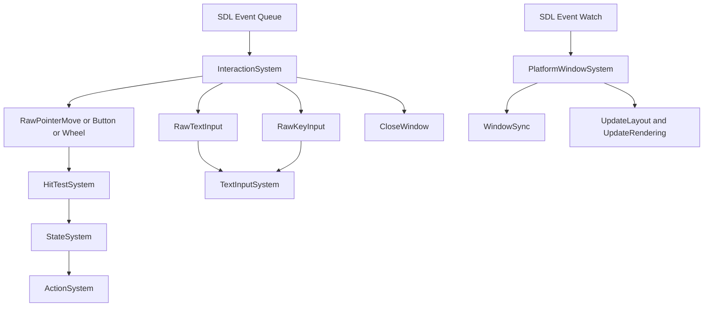

# InteractionSystem 拆分实现记录

日期：2026-03-26

## 文档定位

本文档记录一次已经落地的 UI 交互层拆分实现。

它的职责不是重新定义 UI 重构主线，也不是替代 [../baseline/ui-design-baseline-2026-03-26.md](../baseline/ui-design-baseline-2026-03-26.md) 或 [../phase/ui-phase1-runtime-facade-draft-2026-03-26.md](../phase/ui-phase1-runtime-facade-draft-2026-03-26.md)。

本文只回答三个问题：

1. 这次具体拆出了什么。
2. 拆分后当前运行边界是什么。
3. 还剩下哪些结构债务没有解决。

## 变更背景

拆分前，[../../systems/InteractionSystem.hpp](../../systems/InteractionSystem.hpp) 同时承担以下职责：

1. SDL 轮询输入泵。
2. 鼠标原始事件转发。
3. 文本输入和 TextEdit 编辑逻辑。
4. 键盘长按重复输入策略。
5. 平台窗口事件监听。
6. 窗口属性同步与阻塞场景补救刷新。

这导致一个直接问题：`InteractionSystem` 既是输入入口，又是文本编辑器，又是平台窗口桥接层，边界过宽，后续无论是做 Runtime Facade、phase 显式化，还是进一步引入局部状态机，都会先撞上这个系统的职责缠结。

因此本次调整采取最小可运行拆分，而不是一步到位重写交互链路。

## 本次拆分结果

### 拆分后的系统边界

1. [../../systems/InteractionSystem.hpp](../../systems/InteractionSystem.hpp)
   只保留 SDL 事件轮询、原始输入事件分发、关闭窗口请求转发。
2. [../../systems/TextInputSystem.hpp](../../systems/TextInputSystem.hpp)
   接管 TextEdit 文本输入、键盘编辑行为、剪贴板处理、键盘重复输入策略。
3. [../../systems/PlatformWindowSystem.hpp](../../systems/PlatformWindowSystem.hpp)
   接管 SDL 平台窗口事件 watch、窗口属性同步、窗口像素尺寸变化和 exposed 场景的即时补救刷新。

### 新增的原始事件

为避免让 `InteractionSystem` 继续直接操作 TextEdit，本次在 [../../common/Events.hpp](../../common/Events.hpp) 中新增：

1. `RawTextInput`
2. `RawKeyInput`

它们作为输入泵和文本编辑系统之间的边界事件使用。

## 当前事件路径

## 关键实现点

### 1. InteractionSystem 收缩为输入泵

[../../systems/InteractionSystem.hpp](../../systems/InteractionSystem.hpp) 当前只做以下事情：

1. 在 `pollSdlEvents()` 中循环调用 `SDL_PollEvent`。
2. 将鼠标移动、按键、滚轮转成 `RawPointer*` 事件。
3. 将 SDL 文本输入转成 `RawTextInput`。
4. 将 SDL 键盘按下抬起转成 `RawKeyInput`。
5. 将窗口关闭请求转成 `CloseWindow`。

这里的关键变化是：它不再直接操作 `TextEdit` 组件，也不再维护键盘重复输入状态。

### 2. TextInputSystem 成为 TextEdit 的唯一键盘入口

[../../systems/TextInputSystem.hpp](../../systems/TextInputSystem.hpp) 当前统一接管：

1. `RawTextInput` / `RawKeyInput` 事件订阅。
2. 键盘长按重复输入策略。
3. 将编辑命令转发给 [../../core/TextEditingService.hpp](../../core/TextEditingService.hpp)。

`TextInputSystem::processKeyRepeat()` 由 [../../core/TaskChain.hpp](../../core/TaskChain.hpp) 的 `InputTask` 驱动，因此重复输入策略已经从 SDL 轮询逻辑中分离出来。

与此同时，具体的 TextEdit 编辑算法已经下沉到 [../../core/TextEditingService.hpp](../../core/TextEditingService.hpp)，包括：

1. 文本插入。
2. Backspace/Delete。
3. 光标移动。
4. Shift 选择扩展。
5. Ctrl+A、Ctrl+C、Ctrl+V。
6. 选区删除和内容应用。
7. 单行和多行回车处理。

当前 [../../core/TextEditingService.hpp](../../core/TextEditingService.hpp) 内部已按 helper 粗分为：

1. `TextEditSelectionOps`
2. `TextEditModeOps`
3. `TextEditContentOps`
4. `TextEditClipboardOps`
5. `TextEditNavigationOps`

### 3. PlatformWindowSystem 单独处理平台窗口补救路径

[../../systems/PlatformWindowSystem.hpp](../../systems/PlatformWindowSystem.hpp) 当前负责：

1. 注册和注销 SDL event watch。
2. 识别 `SDL_EVENT_WINDOW_PIXEL_SIZE_CHANGED`、`SDL_EVENT_WINDOW_MOVED`、`SDL_EVENT_WINDOW_EXPOSED`、`SDL_EVENT_WINDOW_SHOWN`、`SDL_EVENT_WINDOW_HIDDEN`。
3. 立即触发 `WindowPixelSizeChanged` 或 `WindowMoved`。
4. 立即同步窗口组件属性。
5. 在像素尺寸变化和 exposed 场景下触发 `UpdateLayout` 与 `UpdateRendering` 补救刷新。

这意味着平台窗口桥接已经不再和输入轮询共居于同一个系统中。

### 4. 系统注册顺序已显式调整

[../../core/SystemManager.cpp](../../core/SystemManager.cpp) 当前的相关注册顺序是：

1. `PlatformWindowSystem`
2. `InteractionSystem`
3. `TextInputSystem`
4. `HitTestSystem`
5. 后续布局、渲染、状态、动作、计时系统

这保证平台窗口事件桥接、原始输入泵、文本键盘处理在系统表中已经是三个独立角色。

## 为什么这次只做最小拆分

这次改动刻意没有继续向下做更激进的重构，原因很明确：

1. 输入泵、文本编辑、平台窗口桥接之间已经有自然边界，先把第一层职责拆开，收益最高。
2. `HitTestSystem`、`StateSystem`、`ActionSystem` 的事件契约还没有正式重写，过早继续下钻会扩大风险面。
3. 当前项目已经有明确的 Phase 基线文档，本次实现更适合作为“边界松绑”，而不是直接改写整条交互主线。

## 这次拆分解决了什么

1. `InteractionSystem` 不再直接持有 TextEdit 编辑行为。
2. SDL 平台窗口事件 watch 不再和输入轮询耦合。
3. 键盘重复输入策略不再混在 SDL 分发入口里。
4. `TextInputSystem` 已经收缩为薄系统，编辑算法被收口到 `TextEditingService`。
5. 后续如果要重构窗口同步策略，也可以围绕 `PlatformWindowSystem` 独立推进。
6. `windowID -> UI 窗口实体` 的重复查找已经收口到 [../../common/WindowEntityLookup.hpp](../../common/WindowEntityLookup.hpp)，并升级为挂在当前 runtime `registry.ctx()` 上的缓存服务，避免 InteractionSystem、PlatformWindowSystem、StateSystem、HitTestSystem 各自维护同类扫描逻辑。

## 这次拆分没有解决什么

本次实现仍然保留了若干明显的结构债务：

1. [../../core/TextEditingService.hpp](../../core/TextEditingService.hpp) 已经完成第一轮 helper 化，但仍然停留在同一头文件内，后续是否要继续拆成独立文件还需要结合复用面再判断。
2. [../../common/WindowEntityLookup.hpp](../../common/WindowEntityLookup.hpp) 的缓存实现仍然是 header-only，但它的对外调用入口已经收口到 [../../core/RuntimeFacade.hpp](../../core/RuntimeFacade.hpp) 的 `windowLookup()` 子服务，后续剩下的问题不再是“要不要进 facade”，而是“是否要进一步拆出更独立的实现文件或更丰富的查询接口”。
3. 平台窗口的“即时补救刷新”仍然是特例路径，还没有被正式提升为 phase 语义的一部分。
4. 原始键盘事件仍以 SDL 键码和修饰符为中心，尚未抽象成更稳定的 UI 输入命令层。

## 建议的下一步

如果继续沿这条线推进，优先级建议如下：

1. 继续把 [../../core/TextEditingService.hpp](../../core/TextEditingService.hpp) 内部按“选区操作”“剪贴板命令”“导航命令”“内容提交”拆成更小的 helper，避免新的服务类再次膨胀。
2. 在 [../../core/RuntimeFacade.hpp](../../core/RuntimeFacade.hpp) 已经暴露 `windowLookup()` 子服务的基础上，继续评估是否需要补更多窗口相关查询入口，或者把现有 header-only 实现下沉为更独立的实现单元。
3. 在 Runtime Facade 落地后，把窗口同步和 frame 刷新补救路径挂到正式 runtime 服务边界上，而不是继续散落在具体系统内部。
4. 再评估是否有必要把 pointer 交互从 `HitTestSystem + StateSystem` 继续拆到局部状态机或更显式的 interaction coordinator。

## 验证结论

本次拆分完成后，相关修改已通过以下验证：

1. 变更文件诊断无错误。
2. Debug CMake 构建成功。
3. UI 单元测试目标已完成链接。

因此可以把这次调整视为一次“已完成的最小职责拆分”，而不是纯草案。